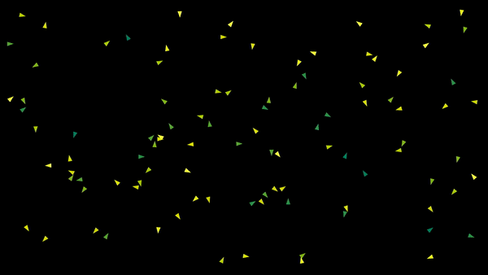

# Boids
Implementation of Craig Reynolds' Boid-Algorithm using Manim. 
The details about the algorithm can be found [here](https://www.red3d.com/cwr/boids/).  
Used a QuadTree for optimization. Find it [here](https://scipython.com/blog/quadtrees-2-implementation-in-python/)  

